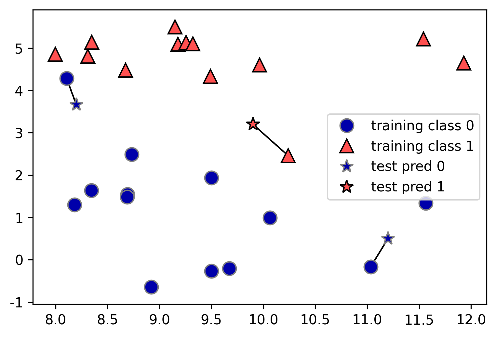

# red-wine-prediction-using-KNN
KNN 알고리즘을 이용하여 레드 와인의 품질 예측  
[와인데이터]( http://archive.ics.uci.edu/ml/machine-learning-databases/wine-quality/winequality-red.csv) (누르면 다운로드 됩니다.)

###KKN이란?
- k nearest neighborhood(K 최근접 이웃)으로 분류 문제에 사용하는 알고리즘입니다. 새로운 데이터가 들어왔을 때 기존 그룹과 가장 가까운 그룹으로 분류합니다.

다음은 knn관련 이미지입니다.

- 각각의 별표는 새로 들어온 데이터를 의미합니다. 가장 가까운 데이터를 따라 클래스가 0과 1로 분류 됩니다.

#### 자세한 부분은 이곳을 참조해주세요
[notebook](wine.ipynb) 

   
